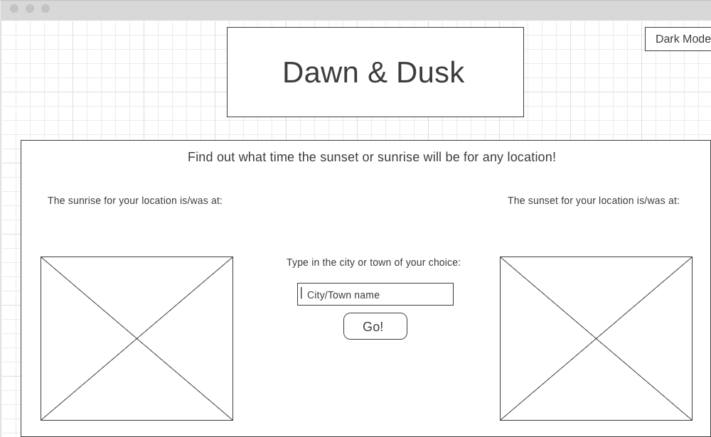

# Suncatcher
## Unit 1 Project for General Assembly SEI

I think sunrise and sunset are the most beatiful times of the day, so I chose to make an app that will let you find the times of sunrise/sunset for any given location. 

-------------

### Sample Layout Design
Here is my first draft of what the app will look like for users

-------------

### User Stories
1. As a user(AAU), I should be able to choose what city/town by name.
2. AAU, I should be able to see the sunrise and sunset times for the location I choose.
3. AAU, I should be able to remove the previous results.
4. AAU, I should be able to input new search criteria to view new results.

-------------

### Technologies Used
HTML, CSS, Javascript, Bootstrap
[Sunrise/Sunset API](https://sunrise-sunset.org/api)
[Location Information from MetaWeather](https://www.metaweather.com/api/)

-------------

### Future enhancements
I'd like to add animations where possible, and possibly weather information for the location chosen. 
I'd also like to let the user input a specific date, and view the time of day that the sunset/sunrise occurred. 