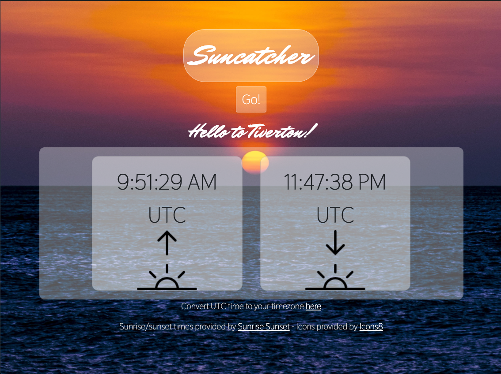

# Suncatcher
## Unit 1 Project for General Assembly SEI

I think sunrise and sunset are the most beatiful times of the day, so I chose to make an app that will let you find the times of sunrise/sunset for your location.

-------------

### Screenshot
Here is what the app looks like after displaying a result:

-------------

### User Stories
As a user, I should be able to see the sunrise and sunset times for my location by clicking a button.

-------------

### Technologies Used
HTML, CSS, Javascript, Bootstrap, [Sunrise/Sunset API](https://sunrise-sunset.org/api), [Location Information from Free IP Geolocation](https://freegeoip.app/json/), [Images from Pexels](https://pexels.com), [Icons from Icon8](https://icon8.com), and [Fonts by Google](https://fonts.google.com/).

-------------

### Getting started
Check out my app [here](https://suncatcher.surge.sh/).

-------------

### Future enhancements
I'd like to add animations where possible, and possibly weather information for the location chosen. 
I'd also like to let the user input a specific date, and view the time of day that the sunset/sunrise occurred. 